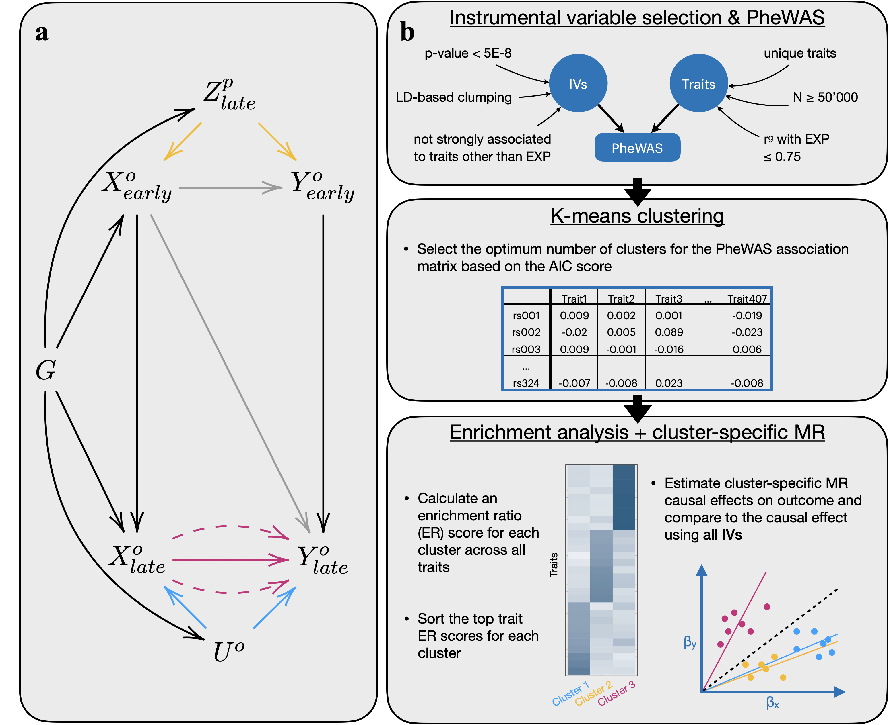

# PheWAS-cluster

:grey\_exclamation: This repository is a work in progress, an example will soon be provided for the scripts. :grey\_exclamation:

## Overview

The scripts in 'PheWAS-cluster' represent our approach of Phe-WAS based clustering of Mendelian Randomisation instruments (PWC-MR). 
Our approach was used to invesitgate the large causal effect of body mass index (BMI) on educational attainment (EDU) -0.19 [-0.22, -0.16], where we hypothesize that potential horizontal pleiotropic effects (emerging due to heritable confounders, dynastic effects, genetic subtypes of obesity and other pleiotropic mechanisms, see **panel a** in the figure below) are biasing BMI's effect on educational attainment..

The main steps of the PWC-MR method are (illustrated in **panel b** of the figure below):
- Instrument selection and PheWAS
- IV clustering 
- Enrichment analysis and cluster specific MR

